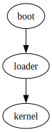

# PlantOS
A simple OS used to study made by several students

## Contribute

<div>
        <div id="afterTitle">A simple OS used to study made by several students</div>
        
</div>
除本描述文件使用标准 Markdown 以外，其余描述文件会使用一种 Markdown 方言，经过预处理器翻译可以得到标准 Markdown ，它主要支持如下的附加功能：

1. 一种快速编写图表的语法。
2. 将 Dot 语言渲染到 HTML。
3. ...

我会在子目录中放置 README.md 文件，作为其目录中代码的速览。

README 的格式应该遵照这个规范（包括顺序），方便使用脚本和终端工具进行处理：

- `## Warnings`   —— 简短说明任意类型的需要特别注意的警告，一般最多两三句话即可。
- `## Using`      —— 说明如何使用目录中的代码。
- `## Testing`    —— 说明应该如何测试目录中的代码。
- `## TODO`       —— 说明那些不适合在代码中内嵌的开发计划。关于目录的介绍，包括目录结构可视化，不要使用二级标题，直接紧跟在一级标题之后即可。
- `## Principle`  —— 说明代码的原理
- `## Contribute` —— 说明代码规范上的惯例和贡献说明

编码时应该暂且将惯例作为规范。

## Principle



boot、loader、kernel 是三个独立的部分，我们通常通过 boot 引导 loader, 通过 loader 加载 kernel 。绝大部分代码都是 Kernel 的一部分。boot 和 loader 相互独立的原因在于，boot 主要与系统外部的事物有关，而 loader 主要与系统内部的事物有关。例如，Kernel 可能被安装在不同文件系统上，在这样的情况下，我们需要重新编译 loader 。而另一种可能是系统被安装在不同的存储介质或磁盘分区上，这可能只需要不同的 boot 。<br>
也就是说，如果你想复制一份操作系统，你需要复制 loader 和 kernel 。你想要将复制的系统安装在怎样的存储介质上？安装在哪个磁盘分区上？你只需要为你要安装它的环境编译 boot 即可。

## Dependencies

你至少需要在系统范围内安装 Python 、在任何位置安装 mformat、mcopy、clang（作为默认值，建议你在系统范围内安装它）以构建本项目<br>
为了在虚拟机中调试本操作系统，你应该在任何位置安装 QEMU 。（作为默认值，建议你在系统范围内安装它）<br>
为了构建文档，你应该在系统范围内安装 Graphviz 。<br>
同时可以使用 gcc 来编译。

## Using

在运行一切命令之前，你应该使用：

```sh
python make.py init
```

来初始化工作区

然后，使用

```sh
python make.py run
```

来构建并运行

`make.py` 有诸多功能，你应该查看它的代码或使用 `python make.py --help`。